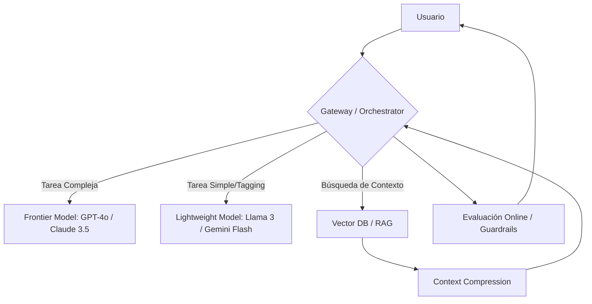

# State of AI Engineering: Analysis (Datadog 2026)

## 📊 Ficha Técnica

- **Fuente**: [Datadog - State of AI Engineering Report](https://www.datadoghq.com/state-of-ai-engineering/)
- **Enfoque**: Transición de prototipos aislados a sistemas de producción multi-modelo.
- **Señal Principal**: La ingeniería de IA está madurando hacia patrones de **Context Engineering** y **Capacity Management**.

## 🔍 El "Por Qué": De la Experimentación a la Ingeniería de Sistemas

En 2025, el reto era "hacer que el LLM responda". En 2026, el reto es la **fiabilidad operativa**. Las organizaciones han pasado de usar un único modelo a orquestar ecosistemas complejos.

> [!TIP]
> **Duality Note:** Para un Junior, esto significa que "saber promptear" ya no es suficiente. Para un Senior, significa que las habilidades tradicionales de ingeniería (backpressure, caching, observabilidad, desacoplamiento) son ahora el factor crítico en IA.

### Evolución de la Arquitectura de IA

## 📈 Tendencias Clave y Señales Técnicas

### 1. Diversificación y "Model Debt"

El 70% de las empresas ya utilizan **3 o más modelos**. La fidelidad a un solo proveedor (OpenAI) está disminuyendo frente a **Anthropic Claude** y **Google Gemini**.

- **Impacto**: Los ingenieros deben diseñar abstracciones que permitan el intercambio dinámico de modelos (Swapping) sin reescribir la lógica de negocio.

### 2. De Prompt Engineering a Context Engineering

Aunque las ventanas de contexto han crecido (hasta 2M de tokens), el ruido aumenta la latencia y el coste.

- **Señal**: El éxito de RAG hoy depende de la **calidad** y la **estructura** del contexto, no del volumen.
- **Dato**: Los "System Prompts" representan el **69% de los tokens de entrada**.

### 3. El Cuello de Botella: Rate Limits (429s)

El error más común en producción (1/3 de los fallos) son los límites de tasa de los proveedores.

- **Estrategia Senior**: Implementar colas de prioridad, lógica de reintento exponencial y *fallback* a modelos locales o secundarios.

## 🛠️ Stack Tecnológico Emergente

| Categoría | Herramientas / Tendencias | Por qué importa |
| :--- | :--- | :--- |
| **Orquestación** | LangChain, Pydantic AI, LangGraph | El uso de frameworks se ha **duplicado**. |
| **Gateways** | OpenRouter, LiteLLM, AWS Bedrock | Centralizan autenticación, compliance y failover. |
| **Optimización** | Prompt Caching | Es la "fruta madura" para reducir costes en un 30-50%. |
| **Observabilidad** | Datadog LLM Obs, LangSmith | Detectar el "Agent Sprawl" (pasos ocultos que disparan costes). |

## 📅 Conclusiones para la Búsqueda de Empleo

> [!IMPORTANT]
> Si estás aplicando a roles de AI Engineer, destaca tu experiencia en **infraestructura** más que en prompts.

1. **Eficiencia de Costes**: Habla sobre cómo implementaste caché de prompts o prefijos para optimizar el spend de API.
2. **Resiliencia**: Explica cómo manejas los errores 429 y 5xx mediante Gateways y estrategias de fallback.
3. **Evals**: Demuestra conocimiento en ciclos de evaluación automatizada para validar que los cambios en el modelo no degradan la calidad.

---
**Fuente Original**: [Datadog - State of AI Engineering Report (2026)](https://www.datadoghq.com/state-of-ai-engineering/)
