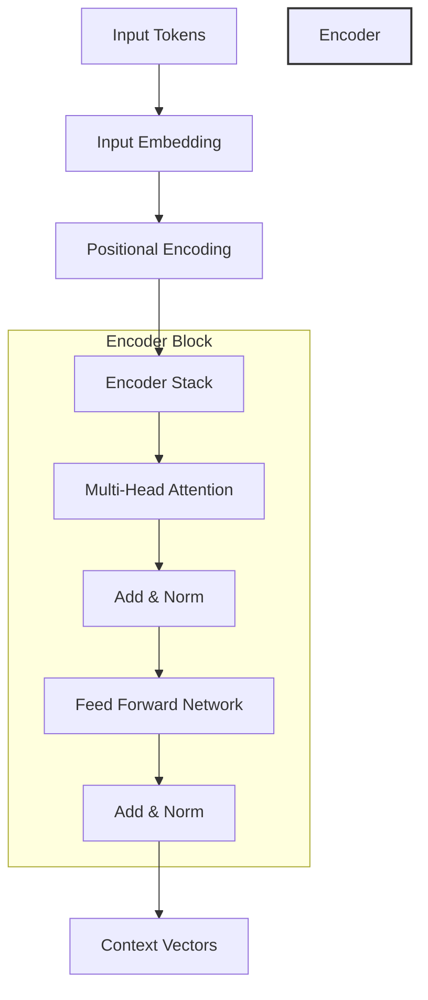

# The Transformer Architecture: El Fin de la Recurrencia

La arquitectura Transformer, introducida en el paper *"Attention is All You Need"* (2017), representa el cambio de paradigma más significativo en el Procesamiento de Lenguaje Natural (NLP) y la Inteligencia Artificial moderna. Es la base de modelos como GPT, Claude y Llama.

## 🧐 ¿Por qué el Transformer?

Antes de 2017, dependíamos de las Redes Neuronales Recurrentes (RNN/LSTM). Estas procesaban la información **palabra por palabra**, como un humano leyendo un libro de izquierda a derecha.

**El problema:**

1. **Cuello de botella secuencial:** No puedes calcular la palabra 10 sin haber procesado las 9 anteriores. Esto impedía la computación paralela masiva en GPUs.
2. **Pérdida de memoria:** A medida que la frase crecía, el modelo "olvidaba" el principio de la oración (gradientes desvanecidos).

**La solución:**
El Transformer elimina la recurrencia y utiliza el mecanismo de **Atención**, permitiendo que cada palabra de una secuencia "mire" a todas las demás simultáneamente.

---

## 🏗️ Anatomía del Transformer

---

## 🧠 Los Tres Pilares Fundamentales

### 1. Self-Attention (El "Foco")

Permite al modelo determinar la relevancia de cada palabra con respecto a las demás. Se calcula mediante tres vectores:

* **Query (Q):** Lo que estoy buscando.
* **Key (K):** Lo que ofrezco para ser buscado.
* **Value (V):** La información que realmente contengo.

> [!NOTE]
> La atención se calcula como `Softmax(QKᵀ / √dₖ)V`. El factor `√dₖ` (escalamiento) es crucial para evitar que los gradientes se vuelvan demasiado pequeños en dimensiones altas.

### 2. Multi-Head Attention (Múltiples Perspectivas)

En lugar de una sola mirada, el modelo utiliza varias "cabezas" de atención en paralelo. Esto permite capturar diferentes tipos de relaciones simultáneamente:

* **Cabeza 1:** Puede enfocarse en la gramática.
* **Cabeza 2:** Puede identificar entidades (personas, lugares).
* **Cabeza 3:** Puede detectar el sentimiento de la frase.

### 3. Positional Encoding (El Sentido del Orden)

Al no ser secuencial, el Transformer es "ciego" al orden de las palabras. Para él, *"El perro muerde al hombre"* y *"El hombre muerde al perro"* serían idénticos.
Para solucionar esto, se inyectan **señales sinusoidales** que codifican la posición de cada token en el vector de entrada.

---

## 📊 Comparativa Técnica: Eficiencia Algorítmica

| Tipo de Capa | Complejidad por Capa | Operaciones Secuenciales | Distancia Máxima entre Tokens |
| :--- | :--- | :--- | :--- |
| **Recurrente (RNN)** | O(n · d²) | O(n) | O(n) |
| **Convolucional** | O(k · n · d²) | O(1) | O(logₖ(n)) |
| **Self-Attention** | **O(n² · d)** | **O(1)** | **O(1)** |

*Donde `n` es la longitud de la secuencia y `d` la dimensión del modelo.*

> [!TIP]
> La gran ventaja del Transformer es que la "distancia" entre cualquier par de palabras es constante (**O(1)**). Esto permite capturar dependencias de largo alcance mucho mejor que cualquier arquitectura previa.

---

## 🚀 Impacto en la Ingeniería de Software

Como Ingeniero Senior, entender los Transformers no solo es útil para el ML, sino para comprender las limitaciones de los sistemas actuales:

1. **Context Window:** El coste computacional de la atención crece cuadráticamente (**O(n²)**) con la longitud de la frase. Por eso existe un límite en el tamaño de los prompts.
2. **Inferencia:** Mientras que el entrenamiento es paralelo, la generación de texto (decodificación) sigue siendo token a token, lo que explica por qué las IAs escriben "en tiempo real".

---

*Este documento es una síntesis técnica para ingenieros que buscan tender un puente entre el desarrollo tradicional y el Deep Learning.*
