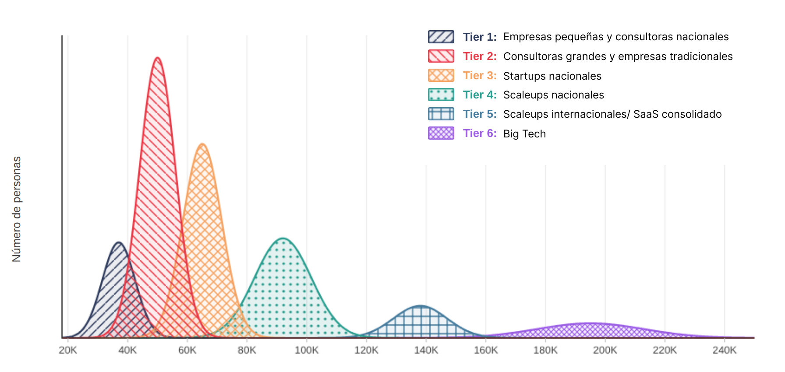

# La Distribución Hexamodal de Salarios Tech en España

Resumen y análisis del concepto de distribución hexamodal propuesto por Manfred
de 2026, esencial para entender el mercado laboral senior en España.

## 🧐 ¿Qué es la Distribución Hexamodal?

A diferencia del modelo trimodal clásico, la realidad del mercado español se
divide en **6 niveles (Tiers)** que no compiten entre sí. El salario de un
ingeniero depende más del modelo de negocio de su empresa que de su habilidad
técnica individual.

---

## 📊 Los 6 Tiers de Mercado (Perfiles Senior)

| Tier  | Tipo de Empresa                         | Rango Salarial (SDE III / Senior) | Ejemplos                                                         |
| :---- | :-------------------------------------- | :-------------------------------- | :--------------------------------------------------------------- |
| **1** | Pymes y Boutique Consultancies          | €30k - €45k                       | Kaspier Data Tech, AracnoSoft, Everis, AtSistemas, Axpe, Televes |
| **2** | Grandes Consultoras / Corp. Tradicional | €45k - €60k                       | Accenture, Singular, BBVA, Telefonica, Grupo Iberia              |
| **3** | Startups Nacionales (Early/Growth)      | €55k - €75k                       | OpositaTest, Tucuvi, Nyxell, Seat CODE, MercadonaTech, ED Puzzle |
| **4** | Scaleups Nacionales Consolidadas        | €70k - €100k                      | Factorial, Cabify, Typeform, Fever, Glovo                        |
| **5** | Scaleups Int. / SaaS Global             | €100k - €180k                     | Github, Docker, Bending Spoons, FreepiK, Revenuecat, Datadog     |
| **6** | Big Tech (Olimpo)                       | €150k - €250k+                    | Google, OpenAI, X, Meta, Spotify, Amazon, Netflix                |

---

## 🏗️ Modelos de Negocio y Clasificación

Esta tabla explica la lógica detrás de por qué estas empresas pertenecen a cada
Tier según su forma de generar ingresos.

| Grupo de Empresas                | Modelo de Negocio Principal                         | Relación con la Tecnología                                    |
| :------------------------------- | :-------------------------------------------------- | :------------------------------------------------------------ |
| **Tier 1 (SME/IT Shop)**         | Outsourcing local y Software Factory.               | La tecnología es un **servicio** que se vende por horas.      |
| **Tier 2 (Corp/Global Consult)** | Servicios profesionales globales o B2C tradicional. | La tecnología es un **soporte** o habilitador del negocio.    |
| **Tier 3 (Seed/Growth)**         | SaaS de nicho o Hubs de innovación corporativa.     | La tecnología es el **producto**, pero el mercado es inicial. |
| **Tier 4 (Nat. Scaleups)**       | Marketplaces o SaaS B2B con fuerte inversión.       | Negocios de **volumen y escala** con capital riesgo nacional. |
| **Tier 5 (Int. SaaS/Product)**   | Infraestructura dev o Apps globales.                | Producto **global** con costes marginales tendentes a cero.   |
| **Tier 6 (Big Tech)**            | Ecosistemas, Cloud, IA y Redes Masivas.             | La tecnología es **infraestructura crítica** mundial.         |

---

## 🗺️ El Mapa de Movilidad entre Tiers

Saltar de un nivel a otro no solo requiere tiempo, sino un cambio de enfoque y
preparación específica.

### 🟢 Del Tier 1 al Tier 2: El Salto Natural

- **Dificultad**: Baja.
- **Requisitos**: Conocimientos técnicos estándar y experiencia en proyectos
  corporativos.
- **Clave**: Es un movimiento horizontal donde se suele ganar estabilidad y un
  ligero incremento salarial.

### 🟡 Del Tier 2 al Tier 3: Cambio de Mentalidad

- **Dificultad**: Media.
- **Requisitos**: **Mentalidad de Producto**.
- **Clave**: Es el paso clásico de consultoría a startup. Hay que dejar de
  pensar en "entregar horas" para pensar en "aportar valor al usuario final". Se
  valora la agilidad y la proactividad.

### 🟠 Al Tier 4: Excelencia Técnica y Autonomía

- **Dificultad**: Alta.
- **Requisitos**:
  - **Inglés fluido**: Capacidad para trabajar en equipos internacionales.
  - **Dominio del ciclo completo (E2E)**: Desde la definición de
    especificaciones hasta el despliegue y paso a producción.
  - **Stack Moderno**: Conocimientos sólidos de DevOps y diseño de sistemas
    escalables.

### 🔴 Al Tier 5 y 6: "La Mini Oposición"

- **Dificultad**: Muy Alta (Alta Fricción).
- **Requisitos**: Más que una mejora técnica diaria, requiere una **preparación
  académica específica**.
- **El Proceso**:
  - Procesos de hasta **7 fases**.
  - Múltiples pruebas técnicas (Live Coding, Algoritmia).
  - Entrevistas profundas de **System Design**.
- **Recurso Clave**: Preparación intensiva con materiales como _"Cracking the
  Coding Interview"_. No es solo saber programar, es saber superar el proceso de
  selección de Big Tech.

---

## 💡 El "Por Qué" detrás de la brecha

La disparidad salarial (ej. €40k vs €140k para el mismo stack) no es aleatoria:

- **Escalabilidad**: Las empresas de Tier 5-6 tienen productos con márgenes
  globales e infinitos.
- **Acceso a Capital**: Fondos de VC internacionales permiten pagar "sueldos de
  Silicon Valley" a ingenieros en España.
- **Centro de Coste vs. Centro de Beneficio**: En Tiers altos, la ingeniería
  _es_ el producto, no un soporte.

---

## 🛠️ Conclusiones para un Senior Engineer

> [!TIP] **Tu techo es estructural, no individual.** Si estás en un Tier 2, no
> alcanzarás salarios de Tier 5 pidiendo un aumento; necesitas cambiar de Tier.

1. **La Preparación es Distinta**: Moverse a Tiers 4-6 requiere dominar
   algoritmos (LeetCode) y _System Design_, habilidades que rara vez se usan en
   el día a día de Tiers 1-2.
2. **El "Coste Oculto"**: Los Tiers altos suelen conllevar mayor presión,
   horarios globales y una barra técnica de entrada muy exigente.
3. **Estrategia de Carrera**: Identifica en qué Tier estás y decide si tu stack
   y esfuerzo están alineados con el potencial de ese mercado.

---

_Fuente:
[Manfred - La distribución hexamodal de los salarios tech en España](https://www.getmanfred.com/blog/la-distribucion-hexamodal-de-los-salarios-tech-en-espana)_
