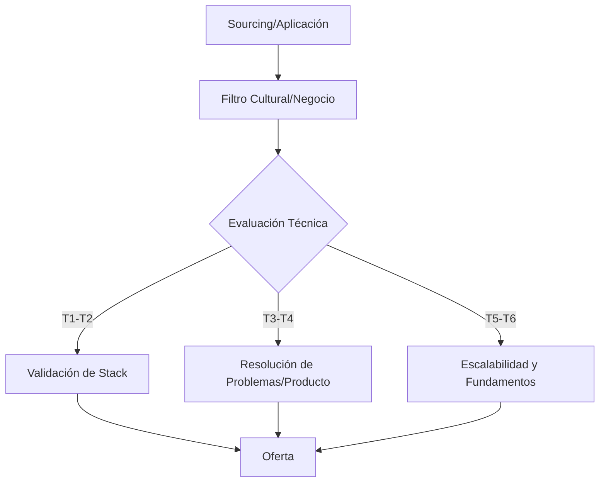

# Estrategia de Entrevistas: El Mapa Hexamodal

En el mercado tech actual, el éxito no depende solo de saber programar, sino de entender en qué liga estás jugando. Este documento actúa como una guía estratégica para navegar los procesos de selección basados en los **6 Tiers de la Distribución Hexamodal**.

---

## 🗺️ Visión General: El Embudo de Selección

Independientemente del Tier, el objetivo de la empresa es mitigar riesgos. Sin embargo, lo que se considera "riesgo" cambia según el modelo de negocio.



---

## 📊 Análisis de Procesos por Tier

### 🟢 Nivel 1 & 2: El Modelo de "Recursos"

* **Contexto:** Consultoría local y corporaciones donde el software es un centro de coste.
* **El Proceso:** 2-3 fases. Muy centrado en el currículum y años de experiencia en una tecnología específica.
* **La Clave:** Demostrar que puedes ser productivo desde el día 1 con su stack actual.
* **Red Flag:** Preguntas de examen de certificación o falta de entrevista con el equipo técnico.

### 🟡 Nivel 3 & 4: El Modelo de "Producto"

* **Contexto:** Startups en crecimiento y Scaleups nacionales (ej. Cabify, Factorial).
* **El Proceso:** 4-5 fases. Incluye una prueba práctica (Take-home o Pair Programming).
* **La Clave:** **Ownership**. No solo entregas código; entiendes el impacto en el usuario y los costes de mantenimiento.
* **Diferenciador:** Calidad de código (SOLID, Clean Code) y capacidad de defensa en la *Code Review*.

### 🔴 Nivel 5 & 6: El Modelo de "Infraestructura"

* **Contexto:** Big Tech y SaaS Globales (ej. Stripe, Datadog, Google).
* **El Proceso:** "La Mini Oposición". 6-8 fases de alta intensidad.
* **La Clave:** Fundamentos inamovibles. No importa si usas React o Angular; importa si entiendes cómo el navegador renderiza o cómo distribuir una base de datos.
* **El "Loop":** Un día completo con 4-5 entrevistas temáticas (Coding, System Design, Behavioral).

---

## 🧠 Matriz de Preparación Estratégica

| Habilidad | Tier 1-2 (Básico) | Tier 3-4 (Intermedio) | Tier 5-6 (Avanzado) |
| :--- | :--- | :--- | :--- |
| **Algoritmia** | No requerida. | Patrones básicos (Two pointers). | LeetCode Med/Hard + Big O. |
| **System Design** | Nociones de arquitectura. | Arquitectura Hexagonal / Microservicios. | Sistemas distribuidos, Consistencia, CAP. |
| **Behavioral** | Fit básico. | Proactividad y Autonomía. | Principios de Liderazgo (Amazon style). |
| **Idiomas** | Español / Inglés técnico (lectura). | Inglés fluido (conversación). | Inglés nativo/profesional C1+. |

---

## 🛠️ Herramientas de "Seniority"

### 1. El Método STAR para Behavioral

Para Tiers 4-6, tus respuestas deben estar estructuradas para evitar divagar:

* **S**ituation: El contexto del problema.
* **T**ask: Tu responsabilidad específica.
* **A**ction: Qué hiciste exactamente (usa "Yo", no "Nosotros").
* **R**esult: El impacto cuantificable (ej. "Reduje la latencia un 20%").

### 2. System Design: El Framework de 4 Pasos

1. **Clarificar Requisitos:** ¿Cuántos usuarios? ¿Lectura o Escritura pesada?
2. **Diseño de Alto Nivel:** Diagrama de bloques (API Gateway, Load Balancer, DB).
3. **Deep Dive:** Escoger una parte crítica (ej. el sistema de caché o la consistencia de datos).
4. **Conclusión:** Trade-offs. Ningún sistema es perfecto; explica por qué elegiste X sobre Y.

---

## 📝 Bitácora de Aprendizaje (Post-Entrevista)

> [!TIP] **Nunca salgas de una entrevista sin aprender algo.**
> Documenta cada proceso fallido en tu journal personal usando esta estructura:

```markdown
### [Empresa] - [Fecha]
- **Tier:** [1-6]
- **¿Qué salió bien?** (ej. Expliqué bien la arquitectura hexagonal).
- **¿Qué falló?** (ej. Me bloqueé en el problema de grafos).
- **Concepto a reforzar:** [Link a documentación o ejercicio de LeetCode].
```

---

> [!IMPORTANT]
> Este documento se complementa con [LeetCode y Algoritmia](./leetcode/leetcode.md). Úsalo para profundizar en la preparación técnica de los Tiers superiores.
