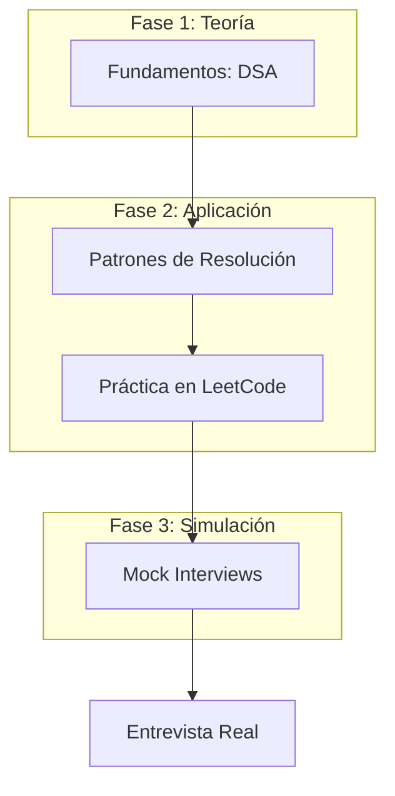

# LeetCode y la Preparación Técnica

La resolución de problemas algorítmicos es una piedra angular en las entrevistas
de ingeniería de software modernas, especialmente en empresas de Producto y Big
Tech (FAANG+). Este documento detalla qué es LeetCode, por qué se utiliza y
recopila los mejores recursos para dominarlo.

## 🧠 ¿Qué es LeetCode?

**LeetCode** es una plataforma de aprendizaje en línea diseñada para ayudar a
los desarrolladores a mejorar sus habilidades de codificación y prepararse para
entrevistas técnicas. Proporciona una vasta biblioteca de problemas de
estructuras de datos y algoritmos (DSA), clasificados por dificultad (Easy,
Medium, Hard).

### ¿Por qué se usa en entrevistas?

Las empresas utilizan este tipo de evaluaciones para medir:

1. **Resolución de Problemas:** Capacidad para descomponer problemas complejos
   en pasos lógicos.
2. **Eficiencia (Complejidad):** Conocimiento de Big O (Tiempo y Espacio) para
   optimizar código.
3. **Dominio del Lenguaje:** Fluidez con las estructuras de datos nativas del
   lenguaje elegido.
4. **Edge Cases:** Capacidad para identificar y manejar escenarios límite
   (nulos, vacíos, desbordamientos).

> [!NOTE] LeetCode no evalúa tu capacidad para construir un sistema completo,
> sino tu agilidad mental y fundamentos de ingeniería bajo presión.

---

## 🗺️ Flujo de Preparación Técnica

---

## 📚 Recursos Recomendados

### 1. Algoritmos y Estructuras de Datos (DSA)

#### Libros

- **Cracking the Coding Interview** (Gayle Laakmann McDowell): El estándar de la
  industria.
- **Grokking Algorithms** (Aditya Bhargava): Introducción visual y amigable para
  principiantes.
- **Elements of Programming Interviews** (Adnan Aziz): Problemas avanzados para
  quienes buscan Tier 1.
- **Introduction to Algorithms (CLRS)**: La "biblia" académica para un
  entendimiento profundo.

#### Canales de YouTube

- **[NeetCode](https://neetcode.io/)**: Indispensable. Ofrece mapas de ruta
  (Roadmaps) y explicaciones visuales de los problemas más comunes.
- **MyCodeSchool**: Excelente para entender cómo funcionan las estructuras de
  datos en memoria (Punteros, Stack vs Heap).
- **Harvard CS50**: Fundamentos sólidos de Ciencias de la Computación.

---

### 2. Diseño de Sistemas (System Design)

Fundamental para roles Senior y Staff.

- **Designing Data-Intensive Applications** (Martin Kleppmann): Lectura
  obligatoria sobre sistemas distribuidos.
- **System Design Interview** (Alex Xu): Guía práctica con casos reales
  (Scalability, Caching, Load Balancers).
- **ByteByteGo**: Explicaciones visuales de arquitecturas modernas.
- **Gaurav Sen**: Desglose detallado de escenarios reales (Balanceadores de
  carga, Caching, DB Sharding).

---

### 3. Preparación Conductual (Behavioral)

No todo es código; el "cómo" trabajas importa tanto como "qué" escribes.

- **Método STAR:** (Situation, Task, Action, Result). Estructura tus respuestas
  para demostrar impacto.
- **Decode and Conquer** (Lewis C. Lin): Enfocado en el "Product Sense" y
  respuestas estructuradas.

---

## 🛠️ Plataformas Clave

- [LeetCode](https://leetcode.com/): La plataforma principal de práctica.
- [NeetCode.io](https://neetcode.io/): La mejor guía curada para navegar
  LeetCode.
- [hashto.net](https://hashto.net/Resources): Map Books Exercise into LeetCode
  Problems.
- [InterviewBit](https://www.interviewbit.com/): Enfocado en la eficiencia del
  tiempo de preparación.

> [!TIP] No intentes resolver 500 problemas aleatorios. Enfócate en dominar los
> **patrones** (Sliding Window, Two Pointers, BFS/DFS, Dynamic Programming)
> usando listas como la _Blind 75_ o _NeetCode 150_.
