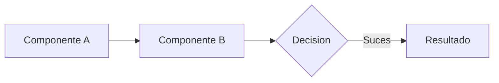

# 📋 SDD Template: [Nombre del Producto/Feature]

Este documento es una especificación técnica diseñada para ser consumida por un Agente de IA. Define la **Intención Arquitectónica** y los **Criterios de Validación** antes de proceder a la fase de implementación.

---

## 1. 🎯 Objetivo y Contexto (The "Why")

*Instrucción para IA: Define el propósito del cambio o producto. ¿Qué problema resuelve y por qué es necesario ahora?*

- **Problema:** [Descripción breve]
- **Solución:** [Descripción técnica de alto nivel]
- **Valor Dual:**
  - **Senior:** [Beneficio en mantenibilidad/arquitectura]
  - **Junior:** [Claridad en el flujo/implementación]

---

## 2. 🏗️ Arquitectura y Flujo

*Instrucción para IA: Describe la estructura del sistema. Usa Mermaid.js para diagramar el flujo de datos o componentes.*



- **Patrones de Diseño:** [Ej: Factory, Strategy, Clean Architecture]
- **Dependencias Clave:** [Listado de librerías/frameworks verificados]

---

## 3. 📝 Especificaciones Técnicas (The "How")

*Instrucción para IA: Define contratos, interfaces y tipos de datos. Sé quirúrgico y evita ambigüedades.*

### Interfaces / Tipos

```typescript
// Ejemplo de contrato
interface IProductSpec {
  id: string;
  version: number;
  metadata: Record<string, any>;
}
```

### Endpoints / API (Si aplica)

- **GET /path:** Descripción y schema de respuesta.

---

## 4. 🚀 Plan de Implementación (Iterativo)

*Instrucción para IA: Divide la tarea en pasos mínimos y validables.*

1. **Investigación:** [Verificar archivos X, Y, Z]
2. **Setup:** [Boilerplate, tipos base]
3. **Lógica Core:** [Implementación del algoritmo/servicio]
4. **UI/Integración:** [Conexión con el resto del sistema]

---

## 5. ✅ Estrategia de Validación

*Instrucción para IA: Define cómo sabremos que la implementación cumple con la spec.*

- **Tests Unitarios:** [Casos críticos a probar]
- **Análisis Estático:** [Reglas de linting o tipos a verificar]
- **Criterios de Aceptación:**
  - [ ] El componente X maneja errores de red.
  - [ ] El estado se persiste correctamente.

---

## 🚫 Restricciones (Don'ts)

- No usar `any` en el sistema de tipos.
- No modificar el archivo `X` a menos que sea estrictamente necesario.
- No introducir dependencias externas nuevas sin aprobación.

---

> [!IMPORTANT]
> **Nota para el Agente:** Este documento es el contrato de ejecución. Si durante la fase de investigación detectas que esta spec entra en conflicto con patrones existentes en el codebase, detente y solicita una re-negociación de la spec.
