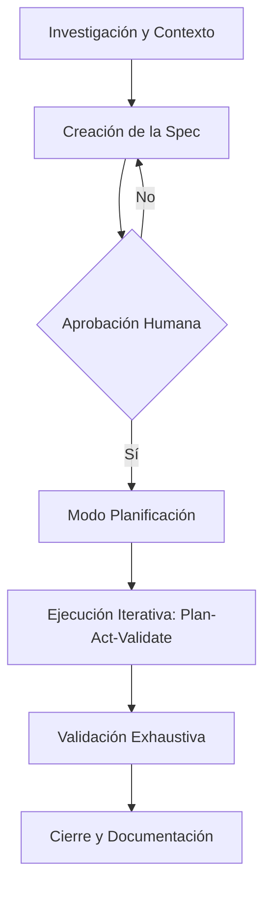

# Spec-Driven Development (SDD)

El **Spec-Driven Development (SDD)** es una metodología de ingeniería de software que prioriza la creación de una especificación técnica detallada y rigurosa antes de escribir una sola línea de código. En el contexto del desarrollo asistido por IA, SDD se convierte en el lenguaje franco entre el ingeniero humano (arquitecto) y el agente de IA (ejecutor).

## 🚀 ¿Qué es SDD y por qué es relevante hoy?

A diferencia de TDD (Test-Driven) donde los tests guían el código, o BDD (Behavior-Driven) donde el comportamiento del usuario manda, **SDD** se centra en la **Intención Arquitectónica**.

> [!NOTE]
> **Dualidad de Valor:** Para un ingeniero senior, SDD es una forma de asegurar la integridad del sistema. Para un desarrollador junior, es una hoja de ruta infalible que evita el "código espagueti" generado por prompts vagos.

### ¿Por qué SDD con Agentes de IA?

1. **Reducción de Alucinaciones:** Al dar una especificación técnica clara (tipos, interfaces, dependencias), el agente tiene menos margen para "inventar" soluciones fuera de contexto.
2. **Eficiencia de Contexto:** Una buena spec permite que el agente trabaje de forma quirúrgica, minimizando el ruido en la historia de la sesión.
3. **Validación Determinista:** Es más fácil verificar si una implementación cumple con una especificación que intentar inferir la intención desde un código ya escrito.

---

## 🔄 El Flujo de Trabajo con Agentes AI

El proceso de desarrollo con agentes bajo SDD no es lineal, sino un ciclo de refinamiento continuo.

### 1. Investigación (Research)

Antes de proponer una solución, el agente debe mapear el codebase. No se puede especificar lo que no se conoce.

- **Herramientas:** `grep_search`, `glob`, `read_file`.
- **Objetivo:** Identificar patrones existentes, convenciones de nombrado y dependencias.

### 2. Creación de la Spec

La especificación debe incluir:

- **Objetivo:** Qué se quiere lograr.
- **Arquitectura:** Patrones a usar (SOLID, Clean Code).
- **Contratos:** Definición de interfaces, tipos de datos y APIs.
- **Criterios de Aceptación:** Tests específicos que deben pasar.

### 3. Ejecución (The Loop: Plan -> Act -> Validate)

Aquí es donde la IA brilla siguiendo la spec:

- **Plan:** Desglose de tareas mínimas.
- **Act:** Cambios quirúrgicos en el código.
- **Validate:** Ejecución de tests, linters y comprobación manual contra la spec original.

---

## 🛠️ Principios de Ingeniería en SDD

Para que SDD sea efectivo, debemos seguir estándares de alta calidad:

- **Modularidad:** Cada parte de la spec debe ser implementable de forma independiente.
- **Inmutabilidad de la Intención:** Una vez que la spec es aprobada, el agente no debe desviarse de ella sin una re-negociación explícita con el humano.
- **Validación como Única Verdad:** Un cambio no está terminado cuando el código compila, sino cuando la validación (tests + análisis estático) confirma que se cumple la spec.

> [!TIP]
> **Proactividad del Agente:** Un buen agente bajo SDD no solo ejecuta, sino que cuestiona la spec si detecta inconsistencias con el codebase actual durante la fase de investigación.

---

## ⚖️ Conclusión: De Prompters a Ingenieros de Intención

El paso de "escribir prompts" a "diseñar especificaciones" es lo que separa el uso casual de la IA de la ingeniería de software profesional. SDD permite escalar el desarrollo delegando la ejecución táctica a los agentes mientras el ingeniero humano mantiene el control estratégico del sistema.
