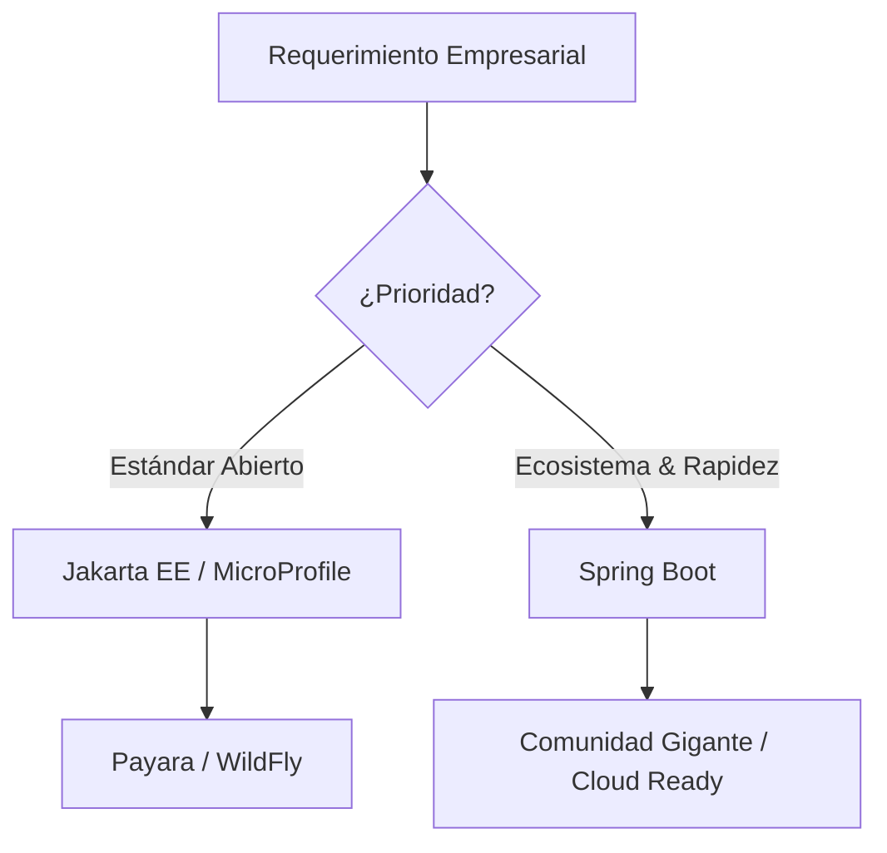

# Java: Senior Engineering Stack

Java no es solo un lenguaje; es un ecosistema resiliente que sustenta gran parte
de la infraestructura crítica mundial. Esta guía resume un stack tecnológico,
priorizando herramientas que equilibran la productividad del desarrollador con
el rendimiento en producción.

## 🚀 Java Versions & LTS Strategy

- **Java 25 (LTS):** La vanguardia. Implementa las últimas optimizaciones de la
  JVM y mejoras en el lenguaje (2025).
- **Java 21 (LTS):** **Hito clave.** Introducción de **Virtual Threads (Project
  Loom)**, permitiendo concurrencia masiva sin la sobrecarga de los hilos del
  SO.
- **Java 17 (LTS):** El estándar de oro actual para nuevos proyectos
  corporativos por su estabilidad y soporte extendido.
- **Java 11 / 8 (LTS):** Mantenimiento de sistemas heredados. Java 8 sigue
  siendo relevante por su longevidad, aunque carece de las optimizaciones de
  memoria de versiones modernas.

> [!TIP] Si empiezas un proyecto hoy, **Java 21** es la recomendación mínima
> para aprovechar la escalabilidad de los Virtual Threads.

---

## 🏗️ Core Frameworks & Specifications

### Jakarta EE & MicroProfile

- **Jakarta EE:** La evolución de Java EE. Ideal para aplicaciones empresariales
  robustas que requieren una especificación estándar.
- **MicroProfile:** Optimización de Jakarta para microservicios. Proporciona
  métricas, tolerancia a fallos y salud de la aplicación de forma nativa.

### Spring Ecosystem

- **Spring Boot / Spring Framework:** El estándar de facto. Su madurez y vasta
  comunidad lo hacen imbatible para APIs REST complejas y sistemas distribuidos.

---

## 🚢 Deployment & Application Servers

La evolución hacia microservicios ha cambiado el rol del servidor de aplicaciones, pasando de pesados contenedores compartidos a runtimes embebidos y ligeros.

### Servidores de Aplicaciones (Jakarta EE Full Stack)

- **WildFly (JBoss):** Potente, modular y el referente para Jakarta EE. Excelente para aplicaciones que requieren el stack completo de servicios empresariales.
- **Payara Server:** Basado en GlassFish, muy popular en entornos que utilizan **MicroProfile**. Ofrece soporte comercial de primer nivel.
- **Open Liberty (IBM):** Moderno, ultra-rápido y diseñado para contenedores (Cloud-Native). Es la base de WebSphere Liberty.

### Contenedores de Servlet (Ligeros & Embebidos)

- **Apache Tomcat:** El rey indiscutible. Es el motor por defecto de **Spring Boot**. Ligero, estable y enfocado puramente en la especificación de Servlets.
- **Jetty (Eclipse):** Conocido por su bajísima huella de memoria. Muy utilizado en sistemas embebidos y aplicaciones que requieren alta escalabilidad con pocos recursos.

### Legacy / Enterprise Heavyweights

- **Oracle WebLogic / IBM WebSphere (Traditional):** Aunque pierden tracción frente a opciones ligeras, siguen siendo el estándar en banca y seguros por sus capacidades de gestión centralizada y soporte masivo.

> [!NOTE]
> La tendencia actual es el **"Fat JAR"**: empaquetar un servidor ligero (Tomcat/Jetty) dentro de la propia aplicación para facilitar el despliegue en Docker/Kubernetes.

---

## ☁️ Cloud-Native & High Efficiency

Para despliegues en Kubernetes donde el tiempo de arranque y el consumo de
memoria son críticos.

- **Quarkus (Supersonic Subatomic Java):** Optimizado para GraalVM, permitiendo
  compilación nativa. Ideal para Serverless.
- **Micronaut:** Inyección de dependencias en **tiempo de compilación**. Elimina
  la reflexión en runtime, reduciendo drásticamente el uso de memoria.
- **Helidon:** La propuesta ligera de Oracle, excelente para microservicios que
  quieren mantenerse cerca de los estándares MicroProfile.

---

## 🤖 AI & Data Engineering

Java está recuperando terreno en IA gracias a frameworks que integran LLMs de
forma segura.

### Artificial Intelligence

- **Spring AI:** Integración fluida de modelos (OpenAI, Ollama) en aplicaciones
  Spring.
- **LangChain4j:** El "navaja suiza" para RAG (Retrieval-Augmented Generation) y
  encadenamiento de prompts en Java.
- **AgentScope Java:** Framework avanzado para la creación de agentes autónomos
  capaces de razonar y ejecutar tareas.

### Big Data & Data Access

- **Apache Spark / Flink:** Procesamiento de datos a escala de Terabytes.
- **JOOQ:** SQL con seguridad de tipos. **¿Por qué?** A diferencia de Hibernate,
  JOOQ no oculta el SQL, dándote control total sin perder el tipado de Java.
- **MapStruct:** Generación de mapeadores en tiempo de compilación. Esencial
  para separar DTOs de Entidades sin impacto en el rendimiento.

---

## 🎨 Frontend en Java

Opciones para equipos que prefieren mantener la lógica de UI dentro del
ecosistema JVM.

- **Vaadin (8-24):** Permite construir UIs modernas (Web Components) escribiendo
  solo Java. Ideal para herramientas internas complejas.
- **Apache Struts:** Framework clásico basado en MVC, comúnmente encontrado en
  modernizaciones de sistemas legados.

---

## 🧪 Testing & Quality

Un cambio no está terminado hasta que está verificado.

- **JUnit 5/6:** El motor de ejecución fundamental.
- **Mockito:** Estándar para el aislamiento de componentes mediante dobles de
  prueba.
- **Testcontainers:** **Recomendación Senior.** Permite levantar bases de datos
  o brokers reales en Docker durante los tests, eliminando el "en mi máquina
  funciona con H2".

> [!WARNING] Evita abusar de los Mocks. Usa **Testcontainers** para pruebas de
> integración con la base de datos real siempre que sea posible.

---

## 🛠️ Build & Dependency Management

- **Apache Maven:** Declarativo (XML), predecible y estandarizado.
- **Gradle:** Programático (Groovy/Kotlin DSL), flexible y optimizado para
  proyectos multimodulares de gran escala.
