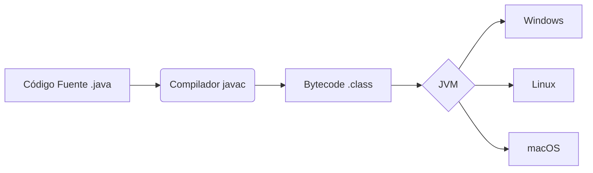

# Java: The Backbone of Enterprise Systems

Java es un lenguaje de programación de propósito general, concurrente, basado en clases y orientado a objetos, diseñado para tener las menores dependencias de implementación posibles. Su filosofía central es **"Write Once, Run Anywhere" (WORA)**.

## ¿Por qué Java?

Java no solo es un lenguaje, es una plataforma. Su éxito en entornos corporativos se debe a:

- **Portabilidad:** Gracias a la Java Virtual Machine (JVM).
- **Gestión de Memoria:** El Garbage Collector (GC) automatiza la liberación de memoria.
- **Seguridad:** Ejecución en un "sandbox" seguro y tipado fuerte.

## Arquitectura de Ejecución

Java compila el código fuente (`.java`) a un formato intermedio llamado **Bytecode** (`.class`), que es interpretado o compilado justo a tiempo (JIT) por la JVM.



## Pilares Técnicos

### 1. Programación Orientada a Objetos (POO)

Java implementa estrictamente los cuatro pilares:

- **Abstracción:** Ocultar detalles complejos y mostrar solo la funcionalidad necesaria.
- **Encapsulamiento:** Restringir el acceso directo a los datos de un objeto.
- **Herencia:** Crear nuevas clases a partir de clases existentes.
- **Polimorfismo:** Permitir que una interfaz sea tratada de diferentes formas.

### 2. Modern Java (Java 8+)

El lenguaje ha evolucionado para adoptar paradigmas funcionales:

- **Lambdas:** Expresiones para tratar el código como datos.
- **Streams API:** Procesamiento declarativo de colecciones.
- **Records (Java 14+):** Clases inmutables de datos concisas.

> [!TIP]
> Prioriza siempre el uso de `Records` para POJOs de solo lectura para reducir el código repetitivo (*boilerplate*).

## Ecosistema Esencial

| Herramienta | Función |
| :--- | :--- |
| **Maven / Gradle** | Gestión de dependencias y automatización de construcción. |
| **Spring Boot** | Framework estándar para microservicios y APIs REST. |
| **JUnit / Mockito** | Pruebas unitarias y simulación de objetos. |

> [!NOTE]
> La elección entre Maven y Gradle suele depender de la preferencia por XML (declarativo) frente a Groovy/Kotlin DSL (programático).

## Ejemplo de Código Limpio

```java
public record User(Long id, String username) {
    public User {
        if (username == null || username.isBlank()) {
            throw new IllegalArgumentException("Username cannot be empty");
        }
    }
}
```

*Este ejemplo utiliza un Record para asegurar inmutabilidad y validación compacta.*
