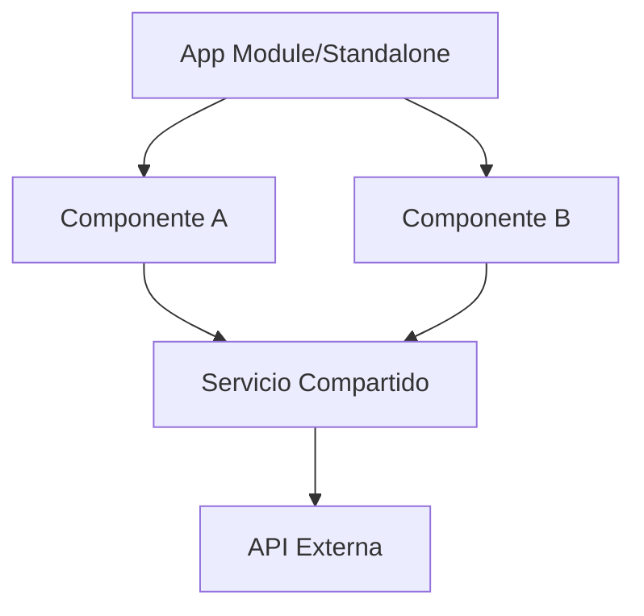

# Angular: The Enterprise Frontend Framework

Angular es un framework de aplicaciones web desarrollado por Google, diseñado para construir aplicaciones escalables y de alto rendimiento. Se diferencia por ser un framework **"opinionated"**, proporcionando una solución completa e integrada de fábrica.

## ¿Por qué Angular?

Es la opción preferida para sistemas complejos y de gran escala debido a:

- **Tipado Fuerte:** Construido nativamente con TypeScript.
- **Estructura Modular:** Facilita el mantenimiento en equipos grandes.
- **Inyección de Dependencias (DI):** Sistema robusto para gestionar servicios y singleton.

## Arquitectura de Componentes

Angular se basa en una arquitectura de componentes donde cada pieza es responsable de una parte de la interfaz y la lógica.



## Pilares Técnicos

### 1. Directivas y Pipes

- **Directivas:** Extienden el HTML con comportamientos personalizados (e.g., `*ngIf`, `*ngFor`).
- **Pipes:** Transforman datos directamente en la vista (e.g., `date`, `currency`).

### 2. Reactividad y Señales (Signals)

- **RxJS:** Gestión de flujos de datos asíncronos mediante Observables.
- **Signals (Angular 16+):** Un nuevo modelo de reactividad granular que optimiza la detección de cambios sin necesidad de Zone.js.

> [!TIP]
> Utiliza `Signals` para estados locales y síncronos para mejorar el rendimiento de renderizado y la legibilidad del código.

## Ecosistema Esencial

| Herramienta | Función |
| :--- | :--- |
| **Angular CLI** | Generación de código, construcción y despliegue. |
| **RxJS** | Librería fundamental para programación reactiva. |
| **Angular Router** | Navegación avanzada y carga diferida (*lazy loading*). |

> [!NOTE]
> La tendencia actual de Angular es hacia los **Standalone Components**, eliminando la necesidad obligatoria de los `NgModules`.

## Ejemplo de Código Moderno

```typescript
import { Component, signal } from '@angular/core';

@Component({
  standalone: true,
  selector: 'app-counter',
  template: `
    <button (click)="increment()">Contador: {{ count() }}</button>
  `
})
export class CounterComponent {
  count = signal(0);

  increment() {
    this.count.update(v => v + 1);
  }
}
```

*Este ejemplo muestra un componente Standalone utilizando Signals para una reactividad eficiente.*
