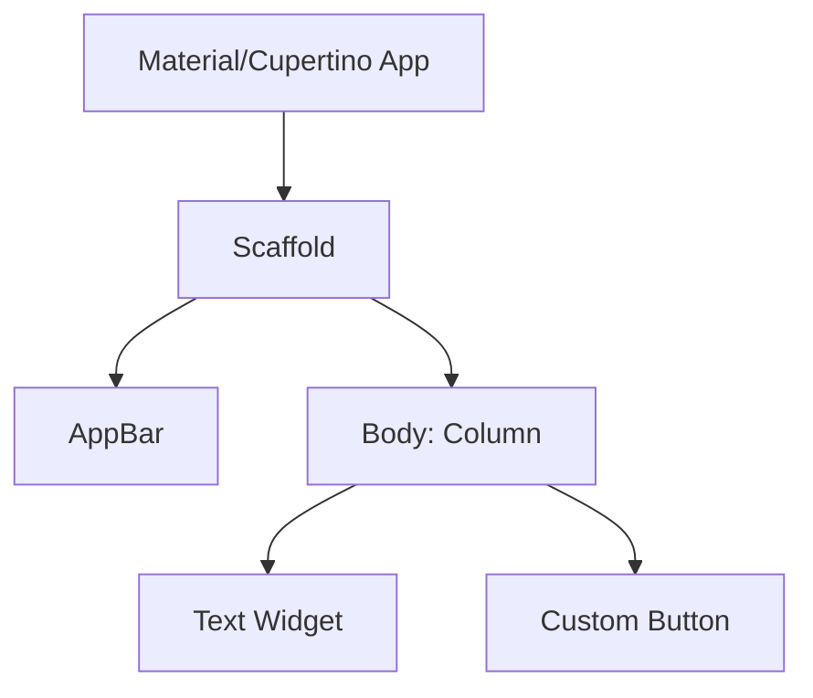

# Flutter: Multi-platform UI Excellence

Flutter es el framework de código abierto de Google para crear aplicaciones multiplataforma compiladas nativamente a partir de un único código base. Su motor gráfico permite una fidelidad visual idéntica en Android, iOS, Web y Escritorio.

## ¿Por qué Flutter?

Flutter destaca por su enfoque radical en el rendimiento y la experiencia de usuario:

- **Pintado Directo:** No utiliza puentes (*bridges*) hacia componentes nativos, sino que dibuja cada píxel mediante su propio motor (Skia/Impeller).
- **Productividad:** El *Stateful Hot Reload* permite ver cambios en el código en menos de un segundo sin perder el estado de la app.
- **Dart:** Un lenguaje optimizado para UI con compilación AOT (Ahead-of-Time) para producción y JIT (Just-in-Time) para desarrollo.

## Arquitectura de Widgets

En Flutter, **todo es un Widget**. La interfaz se construye mediante una composición jerárquica de componentes inmutables.



## Pilares Técnicos

### 1. Composición vs Herencia

Flutter prefiere la composición sobre la herencia. Los widgets se anidan para crear comportamientos complejos de forma declarativa.

### 2. Gestión de Estado

Existen múltiples aproximaciones según la complejidad del sistema:

- **setState:** Para estados locales efímeros.
- **Provider / Riverpod:** Soluciones estándar para inyección de dependencias y estado compartido.
- **BLoC (Business Logic Component):** Utiliza flujos (Streams) para separar la lógica de negocio de la UI.

> [!TIP]
> Para aplicaciones de escala empresarial, **Riverpod** es la recomendación actual por su seguridad en tiempo de compilación y facilidad de testeo.

## Ecosistema Esencial

| Herramienta | Función |
| :--- | :--- |
| **Flutter CLI** | Gestión de proyectos, análisis y construcción. |
| **Pub.dev** | Repositorio oficial de paquetes de Dart y Flutter. |
| **DevTools** | Suite de herramientas de depuración y perfilado de rendimiento. |

> [!NOTE]
> Flutter compila a código de máquina (ARM/x64) en móviles y a JavaScript/CanvasKit en Web, asegurando un rendimiento cercano al nativo.

## Ejemplo de Código Limpio

```dart
import 'package:flutter/material.dart';

class SimpleCard extends StatelessWidget {
  final String title;

  const SimpleCard({super.key, required this.title});

  @override
  Widget build(BuildContext context) {
    return Card(
      child: Padding(
        padding: const EdgeInsets.all(16.0),
        child: Text(
          title,
          style: Theme.of(context).textTheme.headlineMedium,
        ),
      ),
    );
  }
}
```

*Este ejemplo ilustra la naturaleza declarativa y la inmutabilidad de los Widgets en Flutter.*
